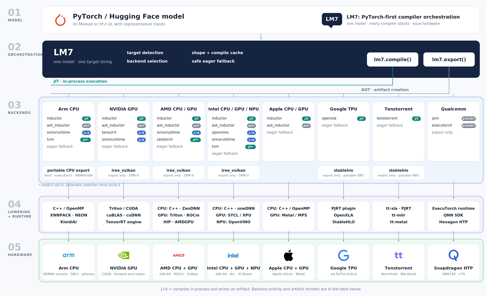
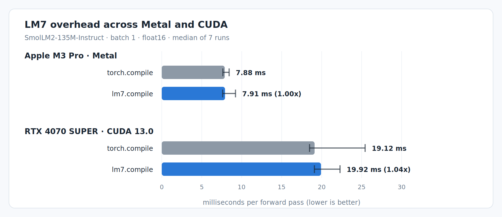
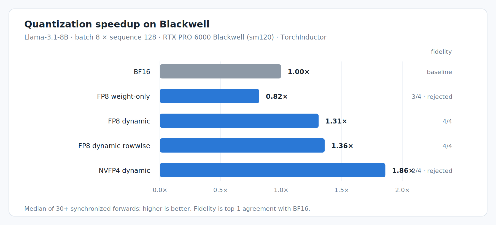

# LM7

[](https://github.com/lmontigny/lm7/actions/workflows/ci.yml)
[](LICENSE)
[](https://www.python.org/downloads/)

**Keep your PyTorch model. Change the hardware target, not your application.**

LM7 is a vendor-neutral compiler orchestration layer for PyTorch inference. It
keeps the normal `nn.Module` interface while detecting hardware, selecting an
available compiler, moving inputs, caching compiled variants, and handling
controlled fallback.

```python
import lm7

compiled = lm7.compile(model.eval(), target="auto")
output = compiled(example_input)
```

> [!WARNING]
> **LM7 is an early, inference-only prototype.** Model coverage and
> compiled-artifact compatibility are not stable. See
> [limitations](docs/limitations.md) before depending on it.

## When should I use LM7?

Use LM7 when the same PyTorch model needs to survive a change of hardware
without growing vendor-specific branches:

- software distributed to users with different accelerators;
- development on one platform and deployment on another;
- servers, workstations, or laptops with more than one kind of accelerator;
- evaluating multiple compiler/runtime stacks for the same PyTorch model;
- accelerator vendors exposing their stack to existing PyTorch applications;
- runtime detection of hardware and compiler availability;
- artifact build, inspection, and loading through one interface.

If one `torch.compile(model)` call already covers your machine and deployment
needs, LM7 is probably extra machinery. On CPU, NVIDIA, AMD, Intel GPU, and
Apple Silicon, LM7 often *does* use `torch.compile` with TorchInductor
underneath. LM7 is not another compiler and does not replace Inductor,
TensorRT, OpenXLA, OpenVINO, or the other toolchains it integrates.

The missing layer is everything around the compiler call:

- detecting NVIDIA, AMD ROCm, Intel XPU, Apple MPS, TPU, and other accelerators;
- normalizing their different device semantics;
- selecting an available compiler for the resolved target;
- moving nested inputs and caching variants by input signature;
- handling first-call compilation failures and controlled fallback;
- explaining backend selection and managing artifacts across compiler stacks.

Some targets are not an Inductor call at all: TPU uses PyTorch/XLA and OpenXLA,
Intel NPU uses OpenVINO, and other accelerators bring their own compiler and
runtime.

```python
lm7.compile(model, target="auto")
lm7.compile(model, target="nvidia", backend="tensorrt")
lm7.compile(model, target="amd")
lm7.compile(model, target="tpu")
lm7.compile(model, target="intel:npu")
```

**PyTorch and hardware vendors provide the compilers. LM7 provides the
vendor-neutral orchestration layer between them.**

LM7's architectural bet is that hardware portability does not require owning
another compiler or runtime. Projects such as ZML and Roofline.ai pursue the
broader goal of hardware-portable ML with cross-hardware compiler/runtime
stacks. LM7 makes a different bet: keep PyTorch, own no compiler, and
orchestrate the mature compiler stacks that already exist.

See [what LM7 replaces](docs/what-this-replaces.md) for the concrete per-vendor
code and behavior it centralizes.

## How it works

LM7 sits between one PyTorch model and the vendor toolchains that compile it.
`lm7.compile()` returns a normal callable; `lm7.export()` writes a versioned
`.lm7` artifact. Both accept the same target vocabulary.



- **Targets and backends are separate.** A target says where the model runs
  (`cpu`, `nvidia`, `apple`, `tpu`); a backend says which compiler gets it
  there (`inductor`, `tensorrt`, `openxla`).
- **Detection is automatic.** `target="auto"` prefers a detected accelerator and
  otherwise uses CPU.
- **Compilation is lazy and signature-aware.** The first call compiles; compiled
  variants are cached by input signature.
- **Fallback is controlled.** A failed backend can warn and fall back to eager,
  or `fallback="error"` can stop immediately.
- **Selection is inspectable.** `lm7 explain --target auto` reports which backend
  would be selected and why.

## Validated on real hardware

> [!NOTE]
> **Intel:** Coffee Lake CPU · Xeon Platinum 8581C Emerald Rapids CPU
>
> **NVIDIA:** RTX 4070 SUPER · H100 · RTX PRO 6000 Blackwell
>
> **AMD:** EPYC x86-64 CPU · Instinct MI300X GPU
>
> **Arm:** Neoverse N2/N3 CPU
>
> **Apple:** M3 Pro · M4 · M4 Pro· iPhone
>
> **Google:** TPU v6e
>
> **Qualcomm:** Snapdragon 8 Elite

These machines have executed LM7 paths on physical hardware. Exact parts, backends,
workloads, and known gaps are recorded in
[tested hardware](docs/tested-hardware.md).

## Benchmarks

Both measured on an Apple M3 Pro (14-core GPU, macOS 26.5.2, torch 2.13.0,
transformers 5.15.0, `apple:metal`, float16). Speed is evidence that the layer
costs nothing, not the reason to reach for LM7: a dedicated single-target engine
will beat it on that engine's own target.

### What compiling through LM7 buys

Generating the same 64 tokens, median of 3:

| | SmolLM2-135M | Llama-3.2-1B |
| --- | --- | --- |
| `model.generate()` — plain PyTorch | 19.01 ms/token | 26.87 ms/token |
| `+ StaticCache + CompileConfig` — Transformers' compiled generation | 18.21 ms/token (1.04x) | 29.51 ms/token (0.91x) |
| `lm7.compile_generation()` | **7.08 ms/token (2.69x)** | **21.90 ms/token (1.23x)** |

The middle row is the interesting one: Transformers gates compiled generation on
a hardcoded device allowlist (`cuda`, `xpu`, `neuron`, `tpu`), so on Apple
Silicon it logs "unable to meet the criteria for compilation" and decodes
eagerly. Forcing its private escape hatch open reaches 1.87x — the GPU was
capable all along. That is an orchestration gap rather than a kernel one.

**The speedup does not transfer upward**: 2.69x is what a launch-bound 135M model
gets, and 1.23x is the same measurement at 1B, where GEMM time dominates. Every
arm produced byte-identical text.
[Method and full table](docs/apple-mps.md#what-compiling-buys-measured-on-an-m3-pro).

### What compiled generation buys on RTX

Llama-3.2-1B, BF16, an English prompt, and 100 generated tokens on the local RTX
4070 SUPER. Both arms use the same static KV cache and eager prompt prefill; only
the repeated decode step changes from eager to
`torch.compile(mode="reduce-overhead")`. Each cell is the median of three full
generations. The table reports **end-to-end speedup**, prefill included:

| prompt tokens | batch 1 | batch 4 | batch 8 |
| ---: | ---: | ---: | ---: |
| 512 | **5.93x** | **4.25x** | **3.42x** |
| 1,024 | **4.55x** | **3.35x** | **3.01x** |
| 2,048 | **3.76x** | **2.50x** | **1.55x** |
| 4,096 | **2.71x** | **1.51x** | 1.08x† |
| 8,192 | **1.94x**† | 1.06x† | did not complete |

This is the shape that transfers to serving: compilation matters at small batch
and moderate context, then approaches a tie as attention and GEMMs dominate. At
2,048 tokens and batch 1, total generation time falls from 3.36 s to 0.89 s; at
batch 8 it falls from 4.20 s to 2.71 s. No steady call recompiled, and CUDA Graph
capture was active in every compiled cell. Building the decode graph still cost
18–27 s once per shape, outside the steady timings.

† The first sixteen greedy tokens diverged from eager in BF16 at these
long-context shapes; they remain performance observations, not correctness
claims. The 8,192 × 8 process did not finish on the 12 GiB card. [Full method,
per-token latency, memory, and H100 rerun](docs/kv-cache-decode.md#measured-on-rtx-4070-super).

### What the layer costs



Within each platform both bars compile through TorchInductor; only one has LM7
in the
call path. Each is the median of 7 runs, and the line through it is the spread
across those runs — **wider than the gap between the bars**, which is the whole
finding.

LM7's default also copies your inputs to the device on every call
(`transfers="automatic"`), which costs about 0.21 ms more; the bar above is
`transfers="explicit"` with inputs already placed. That cost is fixed per call
rather than proportional, so on a 0.44 ms MLP it reads as 1.44x — a fact about
the microbenchmark. [Method and
caveats](docs/apple-mps.md#what-lm7-costs-over-calling-torchcompile-yourself).
The CUDA result tells the same story on different hardware. SmolLM2-135M at
float16 and batch 1 measured 19.12 ms for direct torch.compile (18.49-25.44
across seven runs) and 19.92 ms through LM7 with inputs placed (19.09-22.29),
or 1.04x. The ranges overlap substantially, so this host does not resolve a
reliable difference either. The RTX reports use PyTorch 2.13.0+cu130 and
Transformers 5.14.1 under WSL2, with 100 timed calls per arm in each run.

## Integrated targets

Integration means that LM7 has target and backend code for a toolchain. It does
**not** mean every row has run on physical hardware.

| Vendor | Hardware | `target` | Integrated backends |
| --- | --- | --- | --- |
| Intel, AMD, Arm, Apple | CPU (x86-64, ARM64) | `cpu` | Inductor, AOTInductor, OpenVINO, ONNX Runtime, eager; explicit/export integrations |
| NVIDIA | GPU | `nvidia` | Inductor, AOTInductor, TensorRT, ONNX Runtime, eager, IREE Vulkan export |
| AMD | GPU (ROCm/Vulkan) | `amd` | Inductor, AOTInductor, eager, IREE Vulkan export |
| Apple | GPU (Metal) | `apple` | Inductor, AOTInductor, eager |
| Apple | SoC (Mac/iOS CPU, GPU, ANE) | `apple` | Core ML export/runtime path; iOS simulator validated, physical iPhone pending |
| Intel | GPU (XPU/Vulkan) | `intel` | Inductor, eager, IREE Vulkan export |
| Arm | GPU (Mali/Vulkan) | `arm`, `arm:mali-g715` | IREE Vulkan export; never executed on device |
| Intel | NPU | `intel:npu` | OpenVINO; mock-tested |
| Google | TPU | `tpu` | OpenXLA, eager |
| Tenstorrent | Wormhole, Blackhole | `tenstorrent` | tt-xla/tt-mlir/tt-metal, eager; mock-tested |
| Mobile/embedded | CPU | `cpu` | ExecuTorch export |
| Qualcomm | Snapdragon 8 Elite HTP | `qualcomm:sm8750` | QNN export |
| AWS | Trainium | `aws:trainium` | Parse only; never executed |

Intel XPU, Tenstorrent, Intel NPU, and Trainium have not run through LM7 on real
hardware. AMD ROCm has, once: an MI300X (`gfx942`, CDNA 3) ran detection, the
core benchmark matrix, FP8 quantization, AOTInductor packaging, MoE/dense 7B
capacity checks, short-context decode, local serving, and the vLLM ROCm handoff
— see [AMD MI300X](docs/amd-mi300x.md). See [tested
hardware](docs/tested-hardware.md) and
[limitations](docs/limitations.md#hardware-validation) for the evidence behind
each row.

## Validated models

LM7 does not maintain a model allowlist. The models below have exercised at
least one real compile, generation, export, or quantization path; support still
depends on the selected target and backend.

| Model type | Validated models |
| --- | --- |
| Causal language models | SmolLM2-135M-Instruct, LFM2.5-230M, Llama 3.2 1B Instruct, Llama 3.1 8B Instruct, Qwen3.5-0.8B, DeepSeek-Coder 1.3B Instruct |
| Sparse mixture of experts | Mixtral 8x7B and tiny Mixtral configs; OLMoE-1B-7B and tiny OLMoE configs |
| Vision | ResNet-18, MobileNetV2, ViT Base Patch16 |
| Encoder and sequence models | BERT Base, LSTM reference model |

This is validation evidence, not a guarantee that every model works through
every compiler. Use `lm7 model compatibility hf://...` as a fast preflight,
then run the model on the intended target for the definitive check. See
[model compatibility](docs/model-compatibility.md), [tested hardware](docs/tested-hardware.md),
and [limitations](docs/limitations.md).

## Quick start

LM7 requires Python 3.10+ and a PyTorch build matching the target machine. It
does **not** install GPU drivers, CUDA or ROCm, Xcode, PyTorch/XLA, or vendor
toolchains.

```bash
git clone https://github.com/lmontigny/lm7.git
cd lm7
uv venv --python 3.12
uv pip install torch --torch-backend=auto
uv pip install -e .
```

You still install the driver and compiler/runtime required by your hardware.
LM7 removes the per-vendor application glue and tells you what is missing
through `lm7 doctor`.

```bash
lm7 doctor
lm7 targets
lm7 backends
lm7 explain --target auto
```

Then compile a model without hard-coding its device:

```python
compiled = lm7.compile(model.eval(), target="auto")
result = compiled(example_input)

print(compiled.target, compiled.selected_backend)
```

Per-hardware setup: [CPU](docs/cpu.md) · [NVIDIA](docs/development.md#nvidia-cuda) ·
[AMD ROCm](docs/amd-rocm.md) · [Apple Silicon](docs/apple-mps.md) ·
[Google TPU](docs/google-tpu.md) · [Tenstorrent](docs/tenstorrent.md).

Export and device setup: [ExecuTorch](docs/executorch.md) ·
[Core ML](docs/coreml.md) · [Qualcomm QNN](docs/qnn.md) ·
[Android device testing](docs/android-device-testing.md) ·
[iOS device testing](docs/ios-device-testing.md).

## Compiler and backend overview

| Backend | Compiler/runtime | Mode | Targets |
| --- | --- | --- | --- |
| `inductor` | TorchInductor | JIT | CPU, NVIDIA, AMD, Intel GPU, Apple |
| `openxla` | PyTorch/XLA + OpenXLA | JIT | TPU |
| `tenstorrent` | tt-xla + tt-mlir + tt-metal | JIT | Tenstorrent |
| `aot_inductor` | AOTInductor | AOT | CPU, NVIDIA, AMD, Apple |
| `tensorrt` | Torch-TensorRT | JIT/AOT | NVIDIA |
| `openvino` | OpenVINO | AOT | Intel CPU/NPU |
| `onnxruntime` | ONNX Runtime | JIT/AOT | CPU, NVIDIA |
| `iree_vulkan` | IREE Vulkan | Export | NVIDIA, AMD, Intel, Arm GPU |
| `executorch` | ExecuTorch | Export | CPU/mobile |
| `qnn` | ExecuTorch + Qualcomm QNN | Export | Snapdragon 8 Elite |
| `coreml` | ExecuTorch + Core ML | Export | Apple |
| `stablehlo` | OpenXLA StableHLO + PJRT | Export | Any PJRT target |
| `litert`, `tvm`, `eager` | LiteRT, TVM, plain PyTorch | Export/JIT/eager | See backend guides |

With `backend="auto"`, LM7 chooses the highest-priority installed backend for
the resolved target. Export-only integrations are never selected by
`lm7.compile`. See [JIT vs. AOT](docs/jit-vs-aot.md), the
[architecture guide](docs/architecture.md), and the
[documentation index](docs/README.md) for details and optional dependencies.

## Common workflows

**Hugging Face inference**

```bash
uv pip install -e ".[hf]"
lm7 model run hf://HuggingFaceTB/SmolLM2-135M-Instruct \
  --prompt "The capital of France is" --target auto
```

See [model compatibility](docs/model-compatibility.md) and
[compiled generation](docs/huggingface-generation.md).

**Serving**

```bash
uv pip install -e ".[serve,hf]"
lm7 model serve hf://HuggingFaceTB/SmolLM2-135M-Instruct --target auto
```

See [serving](docs/serving.md) for the OpenAI-compatible local server and the
production NVIDIA handover to vLLM.

**Export**

```python
lm7.export(model, args=(example_input,), target="cpu", output="model.lm7")
loaded = lm7.load_artifact("model.lm7")
output = loaded(example_input)
```

Choose an export backend for AOTInductor, TensorRT, OpenVINO, ONNX Runtime,
IREE, ExecuTorch, QNN, Core ML, or StableHLO payloads. See
[JIT vs. AOT](docs/jit-vs-aot.md) and
[artifact inspection](docs/artifact-inspection.md).

**Inspect compiler output**

```python
artifact = lm7.export(
    model,
    args=(example_input,),
    target="auto",
    backend="aot_inductor",
    output="model-debug.lm7",
    debug=True,
)

for path in artifact.debug_files():
    print(path)
```

Use this when two backends behave differently and you need to see the exported
graph, generated code, or vendor payload. See
[IR inspection](docs/ir-inspection.md).

**Quantization**

```bash
uv pip install -e ".[hf,torchao]"
lm7 model run hf://HuggingFaceTB/SmolLM2-135M-Instruct \
  --target cpu --quantize int8
```



Dynamic FP8 is the measured win: 1.31-1.36x BF16 throughput while preserving
all four top-1 outputs. Faster NVFP4 dynamic is rejected by the fidelity gate;
weight-only INT8 is excluded because its nightly-stack path regressed.

See [quantization](docs/quantization.md) for supported modes, measurements, and
accuracy checks.

Examples and reproducible benchmark harnesses live in
[`examples/`](examples) and [`benchmarks/`](benchmarks).

## Documentation

Start with:

- [Limitations](docs/limitations.md) — what LM7 does not do, per backend.
- [Tested hardware](docs/tested-hardware.md) — physical machines and exact gaps.
- [Architecture](docs/architecture.md) — targets, backends, planner, artifacts.
- [What LM7 replaces](docs/what-this-replaces.md) — per-vendor application glue.
- [JIT vs. AOT](docs/jit-vs-aot.md) — compilation timing and artifact rules.
- [Development and testing](docs/development.md) — running the suite and GPU tests.

The [documentation index](docs/README.md) links every hardware and backend guide.

## Contributing

Issues and pull requests are welcome. Run the checks before opening one:

```bash
uv pip install -e ".[dev]"
python -m pytest -q
python -m ruff check .
python -m ruff format --check .
```

Hardware-specific tests skip automatically when the device or toolchain is
absent. See [development and testing](docs/development.md).

## License

LM7 is licensed under the [BSD 3-Clause License](LICENSE).
