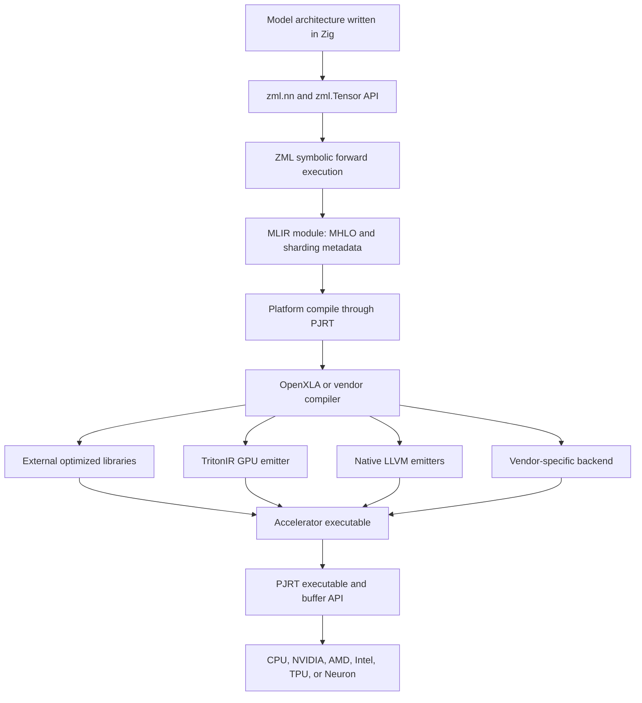
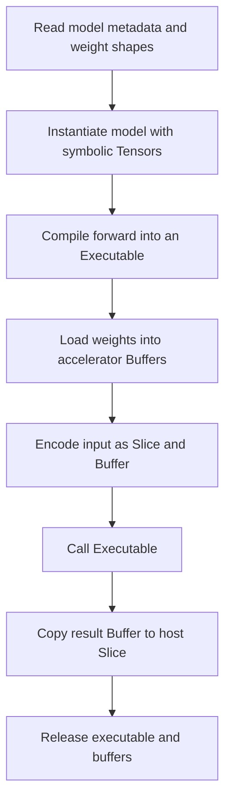
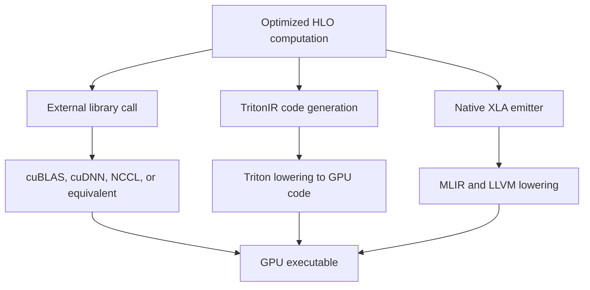
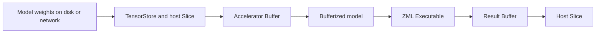

# ZML Technical Notes

Status: Personal technical reference  
Last reviewed: 2026-07-26  
Project: <https://zml.ai/>  
Source repository: <https://github.com/zml/zml>

## 1. Executive summary

ZML is a compiled inference stack written around Zig, MLIR, OpenXLA, PJRT, and
Bazel. Its goal is to let developers describe a model once in Zig and compile
that model for several accelerator families without maintaining a separate
model implementation for every vendor.

The essential architecture is:

```text
Zig model definition
    -> symbolic ZML Tensor operations
    -> MLIR in the HLO family
    -> OpenXLA or a PJRT-connected vendor compiler
    -> accelerator-specific executable
    -> PJRT device and buffer runtime
    -> CPU, NVIDIA, AMD, Intel, TPU, or AWS accelerator
```

ZML should be understood as a complete inference programming and deployment
stack, not merely a Zig binding for a tensor library.

Its main original layer is the Zig-facing model, tensor, loading, and runtime
experience. It deliberately reuses OpenXLA for much of the difficult compiler
optimization and hardware code generation.

## 2. Main design objective

ZML describes itself as a production inference stack intended to decouple AI
workloads from proprietary hardware. The intended user experience is:

1. Describe the model architecture in Zig.
2. Load model metadata and weights from an existing model repository or file.
3. Compile the forward computation for the selected platform.
4. Materialize weights and inputs as accelerator buffers.
5. Execute through a common runtime interface.

This tackles hardware portability at the model compiler/runtime layer.

It does not attempt to preserve the PyTorch programming experience. A PyTorch
model usually has to be ported into an equivalent Zig model implementation.

## 3. End-to-end architecture



The exact internals after PJRT depend on the selected platform. XLA:GPU
internals apply to XLA's NVIDIA/AMD GPU path, while TPU, Intel, or AWS plugins
may use different vendor compiler internals behind the PJRT boundary.

## 4. Equivalent view using the PyTorch compiler-stack terminology

The following mapping is useful when comparing ZML with the compiler diagram
from *AI Systems Performance Engineering*:

| PyTorch compiler concept | Approximate ZML equivalent |
|---|---|
| Python model | Zig model `struct` |
| PyTorch eager tensor library | `zml.Tensor` and `zml.nn` |
| TorchDynamo graph capture | Not required in the same form |
| FX graph | MLIR/HLO-family graph constructed by ZML |
| TorchInductor | OpenXLA |
| Inductor loop-level IR | XLA HLO fusions and target-specific IR |
| Triton kernel generation | XLA TritonIR emitter for selected GPU fusions |
| C++/CPU kernel generation | XLA native LLVM emitters |
| Vendor library calls | cuBLAS, cuDNN, NCCL, and backend equivalents |
| PyTorch device runtime | PJRT plus ZML platform/buffer wrappers |
| `torch.export` | No direct user-facing equivalent; MLIR is generated during compilation |
| AOTInductor artifact | ZML/PJRT accelerator executable |

The analogy is imperfect. PyTorch begins with dynamic Python execution and
needs Dynamo to recover a graph. ZML model code already operates on symbolic
tensor values during compilation, so the graph is constructed directly.

## 5. ZML is compiler-first, not eager-first

A ZML model is a Zig `struct` containing symbolic tensor fields. Its `forward`
function describes the mathematical computation:

```zig
const Model = struct {
    input_layer: zml.Tensor,
    output_layer: zml.Tensor,

    pub fn forward(self: Model, input: zml.Tensor) zml.Tensor {
        const hidden = self.input_layer.matmul(input);
        const output = self.output_layer.matmul(hidden);
        return output;
    }
};
```

During compilation, the tensors do not own model data. Tensor operations build
the MLIR computation.

The actual inference execution later operates on accelerator `Buffer` values,
not on the symbolic `Tensor` objects used to construct the graph.

This separation is fundamental to ZML's architecture.

## 6. Core data types

ZML uses distinct types to represent tensor metadata, host data, device data,
and symbolic computation.

| ZML type | Meaning | Owns/points to data? | Typical phase |
|---|---|---:|---|
| `Shape` | Dimensions, element type, and layout metadata | No | Model discovery and compilation |
| `Slice` | Shape plus raw bytes in CPU memory | Yes or borrowed | Loading inputs/weights and reading results |
| `Buffer` | Multi-dimensional data allocated on an accelerator | Device handle | Execution |
| `Tensor` | Mathematical/symbolic value in a computation | No concrete data | MLIR graph construction |

### 6.1 Shape

Examples:

```zig
zml.Shape.init(.{16}, .f32)
zml.Shape.init(.{512, 1024}, .f16)
zml.Shape.init(.{}, .i32)
```

A scalar is represented by an empty-dimensional shape.

### 6.2 Slice

A `Slice` combines a `Shape` with raw host bytes. It may own or borrow the
underlying CPU memory.

It is used when:

- Reading weight data
- Preparing user inputs
- Receiving results copied back from an accelerator

### 6.3 Buffer

A `Buffer` represents data allocated on an accelerator. It contains a runtime
handle; the underlying physical address is not guaranteed to be visible from
the CPU.

A buffer can be materialized from a host `Slice`.

### 6.4 Tensor

A `Tensor` represents an input, output, weight, or intermediate mathematical
value while a computation is being built.

The ZML documentation describes it as approximately a `Shape` with an attached
MLIR value while inside a compilation context.

## 7. Model and bufferized model

A model used for compilation contains `Tensor` fields:

```text
Model<Tensor>
```

Execution needs an equivalent structure containing accelerator buffers:

```text
Model<Buffer>
```

ZML provides `zml.Bufferize(Model)` to create a mirror type where tensor fields
are replaced with buffers.

Conceptually:

```text
Symbolic model                    Runtime model

Layer.weight: Tensor              Layer.weight: Buffer
Layer.bias: Tensor                Layer.bias: Buffer
forward(Tensor) -> Tensor         call(Buffer) -> Buffer
```

This makes the graph/data distinction visible in the type system.

## 8. Model lifecycle

The documented ZML lifecycle is:



In more detail:

1. Open the model source and read the shapes of its weights without loading all
   weight contents.
2. Instantiate a Zig model `struct` containing `Tensor` fields.
3. Symbolically execute the model's `forward` function to construct MLIR.
4. Compile the generated computation into an accelerator-specific
   `zml.Executable`.
5. Load model weights and materialize the bufferized model on the accelerator.
6. Encode inputs into host slices and accelerator buffers.
7. Invoke the executable with the bufferized model and inputs.
8. Receive result buffers and copy/interpret them on the host.
9. Release runtime resources.

## 9. Compilation can overlap weight loading

Compilation needs shapes, element types, and model structure, but not the
actual weight contents.

Therefore:

```text
Read shapes -> build symbolic model -> compile executable
       \
        -> asynchronously load weight data -> materialize buffers
```

ZML emphasizes that compilation and weight loading are both startup
bottlenecks and can overlap using Zig's asynchronous I/O facilities.

This is particularly valuable for large models where reading weights from disk
or the network is substantial.

## 10. TensorStore

ZML uses a `TensorStore` abstraction to manage the information needed to:

- Discover tensor shapes and metadata
- Construct symbolic tensors
- Load the underlying data later
- Materialize accelerator buffers

The first-model tutorial notes that TensorStore is optional for trivial code,
where shapes and raw data can be created manually.

Its architectural value is separating:

```text
metadata discovery
```

from:

```text
weight data transfer
```

## 11. Symbolic graph construction

ZML does not need to inspect arbitrary Zig code in the way TorchDynamo inspects
Python execution.

Instead:

1. The model's `forward` method runs with symbolic `zml.Tensor` values.
2. Operations such as `add`, `mul`, `dot`, `matmul`, and `conv2D` create MLIR
   operations.
3. Nested Zig model structs create nested software organization while
   contributing to the same computation.
4. Input/output types and tensor shapes are known during compilation.

This is conceptually similar to tracing a model using symbolic tensors, but the
symbolic model API is ZML's normal programming interface rather than a recovery
mechanism applied to eager execution.

## 12. MLIR layer

ZML generates an MLIR module representing the model computation.

Current examples show HLO-family operations such as `mhlo` and sharding
metadata such as `sdy.mesh`. It is safest to describe the boundary as:

```text
MLIR using MHLO/StableHLO-family semantics plus sharding metadata
```

rather than assume every ZML version exposes exactly the same dialect name.

The MLIR graph carries:

- Tensor shapes
- Element types
- Mathematical operations
- Function boundaries
- Sharding information
- Replication/partition configuration

ZML itself constructs this high-level graph. OpenXLA performs most subsequent
optimization and target lowering.

## 13. OpenXLA role

OpenXLA is the main graph compiler beneath ZML.

Its responsibilities include:

- Converting the external HLO representation into internal HLO
- Algebraic simplification
- Constant folding and common-subexpression elimination
- Target-aware layout assignment
- Operation fusion
- Buffer assignment
- Execution scheduling
- Library-call selection
- Target-specific code generation
- Device executable construction

This is why ZML does not need to build a full compiler optimization stack from
scratch.

## 14. PJRT role

PJRT is the boundary between the framework and accelerator compiler/runtime.

Conceptually it provides:

- Device discovery
- Compiler invocation
- Loaded executables
- Device buffers
- Host-to-device and device-to-host transfers
- Execution
- Synchronization

ZML wraps PJRT in Zig-facing platform, executable, and buffer APIs.

The architecture is:

```text
ZML framework
    -> PJRT client/API
    -> selected PJRT plugin
    -> XLA or vendor compiler/runtime
    -> device
```

PJRT is important because a new hardware vendor can expose a PJRT plugin
without requiring ZML's model frontend to change substantially.

## 15. Platform selection

The first-model tutorial uses:

```zig
var platform: *zml.Platform = try .auto(allocator, io, .{});
defer platform.deinit(allocator);
```

The platform object represents the selected compilation and execution
environment.

Compilation resembles:

```zig
var executable = try platform.compile(
    allocator,
    io,
    layer,
    .forward,
    .{input},
    .{ .shardings = &.{sharding} },
);
defer executable.deinit();
```

The call takes:

- The model value
- The forward function
- Symbolic input tensors
- Sharding information
- Platform/compiler context

and produces a target executable.

## 16. Sharding and multiple devices

ZML's compilation interface includes sharding specifications.

The simple tutorial creates replicated sharding:

```zig
const sharding = try zml.sharding.replicatedSharding(platform);
```

Even a single-device example passes sharding information into compilation.

This design leaves room for:

- Replicated tensors
- Partitioned tensors
- Multi-device model execution
- Target-aware collective insertion

Generated examples include Shardy-style metadata such as `sdy.mesh`.

The presence of sharding in the API does not by itself establish complete,
optimized tensor/pipeline/expert parallel support for every model and backend.
That must be evaluated separately.

## 17. XLA GPU optimization path

When ZML targets an XLA GPU backend, XLA performs graph-level and kernel-level
decisions.

### 17.1 Layout assignment

XLA selects physical tensor layouts appropriate to the target and propagates
those layouts through the graph. Conflicting layouts may require explicit copy
or transpose operations.

### 17.2 Fusion

XLA groups compatible HLO operations into fused computations. A GPU fusion is
compiled as one kernel and avoids materializing intermediate values in HBM.

This reduces:

- Kernel launch overhead
- Intermediate global-memory writes
- Intermediate global-memory reads

### 17.3 Buffer assignment

Because the whole graph is available, XLA can assign and reuse buffers based on
future liveness rather than allocate each eager intermediate independently.

### 17.4 Scheduling

XLA produces an execution schedule containing generated kernels, library calls,
copies, and synchronization.

## 18. XLA GPU code-generation choices

XLA:GPU currently has three broad ways to implement an operation or fusion:



### 18.1 External libraries

For established operations, XLA may select optimized libraries such as:

- cuBLAS
- cuDNN
- NCCL

Equivalent libraries may be used on other vendors.

Libraries provide strong tuned performance but can restrict fusion across the
library boundary.

### 18.2 TritonIR emitter

For selected advanced fusions, including matmul and softmax-like patterns,
XLA can:

1. Select a tiling configuration.
2. Convert the HLO fusion to TritonIR.
3. Invoke Triton as a code-generation layer.
4. Generate PTX or the corresponding GPU output.

Therefore, ZML can use Triton indirectly:

```text
ZML -> HLO -> XLA fusion -> TritonIR -> GPU kernel
```

ZML itself does not directly generate Triton programs.

### 18.3 Native emitters

XLA also lowers operations through its own GPU emitters, progressively using
MLIR dialects and LLVM IR.

Examples include:

- Loop-style elementwise operations
- Reductions
- Transposes
- Concatenations
- Scatter/select-and-scatter patterns

The available emitter set evolves with OpenXLA.

## 19. Host runtime generation

The GPU executable is more than isolated kernels.

XLA's runtime representation can include:

- Kernel launches
- Library calls
- Buffer operations
- Copies
- Synchronization
- Host-side sequencing

The host-side runtime portion can be lowered through LLVM to a CPU executable
that coordinates device execution.

## 20. Supported platforms

The ZML repository and documentation advertise or expose platform integrations
for:

- CPU
- NVIDIA CUDA
- AMD ROCm
- Intel OneAPI
- Google TPU
- AWS Trainium/Inferentia through Neuron

Example Bazel flags documented for deployment include:

```text
--@zml//platforms:cuda=true
--@zml//platforms:rocm=true
--@zml//platforms:tpu=true
--@zml//platforms:neuron=true
--@zml//platforms:cpu=false
```

The repository README also lists OneAPI. The deployment documentation does not
always list every platform in the same place, so actual support and maturity
should be verified against the current repository and the exact hardware.

Backend presence does not guarantee equal:

- Operator coverage
- Performance
- Dynamic-shape support
- Distributed support
- Debugging quality
- Release stability

## 21. Build and deployment layers

There are two distinct compilation concerns.

### 21.1 Application build

Zig and Bazel build the host application and its ZML dependencies:

```text
Zig source + Bazel targets -> host executable/package
```

### 21.2 Model compilation

At application startup or an explicit compilation step:

```text
symbolic ZML model -> platform.compile -> PJRT compiler -> accelerator executable
```

These stages should not be conflated.

A Bazel cross-build creates a host program for a target platform, while the
program's ZML/PJRT path still governs how the model becomes an accelerator
executable.

## 22. Cross-compilation and packaging

ZML documents host cross-compilation targets for:

- Linux x86-64
- Linux ARM64
- macOS ARM64

It also documents creating compressed tar archives with Bazel for transfer to a
remote server.

Example conceptual deployment:

```text
Development machine
    -> Bazel cross-build
    -> tar.zst application package
    -> copy to GPU/TPU server
    -> run with target platform enabled
```

This is a practical production feature: deployment is a native program/package,
not a Python virtual environment containing the original training framework.

## 23. Model loading and Hugging Face

The LLM example accepts Hugging Face model identifiers:

```text
hf://meta-llama/Llama-3.2-1B-Instruct
```

The current repository README lists example support for model families such as:

- Llama 3.1/3.2
- Qwen 3.5
- LFM 2.5

This list changes over time and should be treated as an example-implementation
matrix, not universal Hugging Face compatibility.

ZML can load weights and metadata from an existing model repository, but the
corresponding model architecture and forward logic still need a ZML
implementation.

## 24. Porting from PyTorch

ZML's documented PyTorch porting flow is a development and validation process,
not a general one-command PyTorch graph importer.

A typical port involves:

1. Identify the PyTorch module/layer architecture.
2. Implement equivalent Zig structs and `forward` methods.
3. Preserve parameter naming and shapes.
4. Capture representative PyTorch inputs and outputs.
5. Load the same weights in ZML.
6. Compare intermediate or final activations.
7. Debug Zig errors, missing buffers, shape mismatches, and MLIR errors.

Therefore:

```text
PyTorch model -> manual/assisted architecture port -> ZML Zig model
```

not:

```text
arbitrary PyTorch code -> automatic ZML executable
```

This is one of the largest differences between ZML and the proposed LM7
frontend.

## 25. Error layers

ZML development can expose errors from several layers:

1. Zig compilation errors
2. Model/weight naming and buffer lookup errors
3. Shape or dtype mismatches
4. MLIR verification/compilation errors
5. XLA compiler errors
6. PJRT plugin/runtime errors
7. Vendor driver/library errors
8. Model correctness differences

The stack is powerful but deep:

```text
Zig -> ZML -> MLIR -> XLA -> PJRT -> vendor runtime -> device
```

Effective debugging requires being able to locate which boundary introduced
the failure.

## 26. AOT versus JIT interpretation

ZML is best described as a compiled inference stack, but the term "AOT" needs
care.

- The Zig host application is compiled ahead of time.
- The model graph is constructed and submitted to the platform compiler.
- `platform.compile` produces an accelerator-specific executable.
- Compilation can happen during application startup.
- The resulting executable is then reused for inference calls.

This is different from:

- PyTorch eager execution
- Fine-grained Triton kernel JIT on each operation
- A fully prebuilt universal binary containing optimized kernels for every
  possible accelerator and input shape

Executable serialization and cache behavior should be verified for the exact
ZML/PJRT backend being evaluated.

## 27. Runtime data flow



User inputs follow the same host-slice to device-buffer path.

## 28. What ZML owns versus reuses

| Layer | Primarily owned by |
|---|---|
| Zig model API | ZML |
| Tensor/shape/buffer types | ZML |
| Model utilities and layers | ZML |
| Model loading/TensorStore integration | ZML |
| MLIR graph construction | ZML |
| Zig PJRT bindings and platform wrappers | ZML |
| High-level graph optimization | OpenXLA |
| Layout/fusion/buffer assignment | OpenXLA/backend |
| GPU emitters and Triton integration | OpenXLA |
| CPU/GPU LLVM lowering | OpenXLA/LLVM |
| TPU/Neuron/OneAPI compilation | Corresponding backend/plugin |
| Device driver and low-level libraries | Hardware vendor |
| Build orchestration | Bazel and ZML rules |

This is why ZML is both substantial and smaller in scope than building an
entire compiler/runtime independently.

## 29. What ZML changes about CUDA lock-in

ZML helps reduce CUDA lock-in because:

- Model source is written against ZML tensor operations, not CUDA kernels.
- The same high-level model can be submitted to several compiler backends.
- Device interaction occurs through PJRT rather than a CUDA-only framework API.
- XLA can generate kernels or select libraries based on the target.

However, it does not make CUDA irrelevant:

- NVIDIA execution still needs NVIDIA's driver/runtime stack.
- XLA may call cuBLAS, cuDNN, NCCL, or other NVIDIA libraries.
- Some optimizations and kernels may be best on NVIDIA first.
- Backend capability and performance are not automatically equal.

ZML weakens the coupling between model code and NVIDIA hardware. It does not
replace every component of the NVIDIA platform.

## 30. Strengths

### 30.1 Clear graph/data separation

The `Tensor` versus `Buffer` distinction makes compilation and execution phases
explicit.

### 30.2 Small systems language

Zig provides:

- Native binaries
- Explicit allocation
- C interoperability
- Compile-time metaprogramming
- Low runtime overhead

### 30.3 Reuse of a mature compiler

OpenXLA provides existing graph optimizations and multiple backend paths.

### 30.4 Common device boundary

PJRT provides a framework-independent compiler/runtime integration point.

### 30.5 Parallel startup work

Graph compilation can overlap weight loading.

### 30.6 Deployment focus

Bazel cross-compilation and native packaging are part of the documented
workflow.

### 30.7 Sharding is part of compilation

The compile API takes sharding rather than treating multi-device placement as
an unrelated afterthought.

## 31. Limitations and risks

### 31.1 Model porting cost

Existing PyTorch architecture code generally must be rewritten in Zig.

### 31.2 Ecosystem size

PyTorch has far broader:

- Model coverage
- Operator coverage
- Documentation
- Debugging tools
- Quantization integrations
- Serving integrations
- Community knowledge

### 31.3 Backend parity

A single HLO graph does not guarantee identical support or performance on all
accelerators.

### 31.4 Compile time

XLA compilation can contribute noticeable startup latency, particularly for
large or highly specialized graphs.

### 31.5 Dynamic workloads

Dynamic shapes, changing sequence lengths, KV-cache mutation, and continuous
batching require careful representation and specialization.

### 31.6 Deep debugging stack

Failures can cross Zig, MLIR, XLA, PJRT, vendor compiler, runtime, and driver
boundaries.

### 31.7 Build complexity

Zig plus Bazel plus OpenXLA and vendor dependencies can make version management
and builds heavy even if the deployed program is lean.

### 31.8 Performance claims require target-specific measurement

"One model, many hardware targets" does not establish performance parity with
vLLM, TensorRT-LLM, TorchInductor, vendor kernels, or handwritten
implementations.

## 32. ZML versus IREE

| Dimension | ZML/OpenXLA | IREE |
|---|---|---|
| User frontend | Zig model API | Imports from PyTorch/JAX/ONNX and MLIR |
| Main graph compiler | OpenXLA | IREE compiler |
| Runtime abstraction | PJRT | IREE HAL and VM |
| Artifact model | PJRT/backend executable | VMFB plus parameters |
| CPU | XLA/PJRT CPU | LLVM CPU |
| NVIDIA/AMD | XLA/PJRT GPU paths | CUDA/ROCm HAL targets |
| Vulkan/Metal | Not the central path | First-class deployment targets |
| TPU/Trainium | Strong through PJRT ecosystem | Not the primary strength |
| Model API ownership | ZML | Usually external framework |

ZML is a framework plus compiler frontend using OpenXLA. IREE is itself a
compiler/runtime substrate that other frontends can target.

## 33. ZML versus Modular MAX

Both are compile-first systems seeking hardware portability.

ZML:

- Uses Zig
- Reuses OpenXLA and PJRT extensively
- Is comparatively focused on inference and deployment
- Exposes its model structure directly in a systems language

Modular MAX:

- Uses Python-facing graph APIs and Mojo kernels
- Owns more of its graph compiler, kernel programming layer, and runtime stack
- Pursues a broader vertically integrated platform

ZML can be summarized as:

```text
new model frontend + established compiler/runtime substrate
```

Modular is closer to:

```text
new language + new graph/kernel stack + integrated runtime/product
```

## 34. ZML versus LM7

| Dimension | ZML | LM7 proposal |
|---|---|---|
| User source | Zig model | Existing PyTorch model |
| One-line PyTorch adoption | No | Primary objective |
| Graph path | ZML -> HLO -> OpenXLA | PyTorch -> target planner |
| Compiler policy | Unified XLA/PJRT-oriented path | Best compiler per target |
| NVIDIA | XLA:GPU | TensorRT/AOTInductor candidate |
| AMD | XLA/ROCm PJRT | Inductor/Triton or IREE |
| Intel/CPU | XLA/OneAPI/CPU | OpenVINO, Inductor, or IREE |
| TPU/Trainium | PJRT ecosystem | XLA/Neuron adapter |
| Runtime | PJRT/ZML | Multiple runtimes behind LM7 adapters |
| Compiler code owned | MLIR frontend and bindings | Ideally none initially |

ZML gains architectural uniformity. LM7 sacrifices uniformity to preserve
PyTorch compatibility and use the strongest native compiler per target.

## 35. Lessons applicable to LM7

### 35.1 Separate symbolic model from materialized weights

LM7 should avoid requiring all weight data merely to determine whether a model
can be captured or compiled.

### 35.2 Make the platform boundary explicit

Target identity, compiler identity, runtime identity, and device identity should
not be conflated.

### 35.3 Keep execution buffers distinct from graph tensors

This becomes important when LM7 wraps IREE, TensorRT, OpenVINO, PJRT, and AOTI
artifacts with different native buffer types.

### 35.4 Treat sharding as compilation input

Long-term multi-device support should be represented in the compile request,
not patched into an already compiled single-device artifact.

### 35.5 Overlap compilation and loading

LM7 can compile from metadata/profile information while weights are loaded or
uploaded.

### 35.6 Use existing compiler boundaries

ZML demonstrates the leverage of building a strong frontend/runtime experience
over an existing compiler such as OpenXLA.

## 36. Questions to investigate before depending on ZML

1. Which model architectures are maintained and tested today?
2. Which exact PyTorch operators or Hugging Face configurations can be ported
   without custom implementation?
3. What dynamic-shape guarantees exist?
4. How are KV caches and stateful decoding represented?
5. How are compiled executables serialized and cached per PJRT backend?
6. What are cold-start compile and weight-load times?
7. What quantization formats are supported per backend?
8. How are custom kernels integrated?
9. What is the performance versus vLLM, TensorRT-LLM, Inductor, and llama.cpp
   on the same model and target?
10. Which collectives and multi-device shardings are production-ready?
11. What failure/debug tooling exists for generated MLIR/HLO?
12. What is the version compatibility policy across Zig, LLVM/MLIR, OpenXLA,
    PJRT plugins, and vendor runtimes?
13. Is Intel OneAPI support feature-complete relative to CUDA/ROCm?
14. Which deployment targets are regularly exercised in CI?
15. What is the licensing and support model for production adoption?

## 37. Compact mental model

The shortest accurate description is:

```text
ZML is a Zig-native inference framework that builds an MLIR/HLO graph,
delegates optimization and hardware compilation to OpenXLA or PJRT-connected
vendor compilers, and executes the resulting program through PJRT buffers and
executables.
```

The key distinction from PyTorch is:

```text
PyTorch:
dynamic eager program -> capture/compile selected regions

ZML:
symbolic compiled model definition -> accelerator executable -> explicit buffers
```

## 38. Primary sources

- ZML repository: <https://github.com/zml/zml>
- ZML website: <https://zml.ai/>
- ZML documentation: <https://docs.zml.ai/>
- ZML concepts and lifecycle: <https://docs.zml.ai/learn/concepts/>
- Writing a first ZML model: <https://docs.zml.ai/tutorials/write_first_model/>
- Deploying and cross-compiling:
  <https://docs.zml.ai/howtos/deploy_on_server/>
- Porting PyTorch models:
  <https://docs.zml.ai/howtos/howto_torch2zml/>
- FOSDEM 2025 ZML overview:
  <https://archive.fosdem.org/2025/schedule/event/fosdem-2025-5923-zml-a-high-performance-ai-inference-stack-built-for-production-and-multi-accelerator-deployment/>
- OpenXLA architecture: <https://openxla.org/xla/architecture>
- OpenXLA GPU architecture: <https://openxla.org/xla/gpu_architecture>
- OpenXLA GPU emitters: <https://openxla.org/xla/emitters>
- StableHLO: <https://openxla.org/stablehlo>
- PJRT terminology: <https://openxla.org/xla/terminology>

## 39. Notes on confidence

Statements directly about ZML's model types and lifecycle are based on current
ZML documentation.

Descriptions of fusion, TritonIR, LLVM emitters, buffer assignment, and NVIDIA
library selection describe the current OpenXLA GPU backend. Other PJRT plugins
may use different compiler internals.

Supported-target lists are project claims and integration entry points. They
should not be interpreted as a benchmarked guarantee of equal feature coverage
or performance.

Because ZML, Zig, OpenXLA, and accelerator backends evolve quickly, verify the
repository and documentation again before making a production decision.
