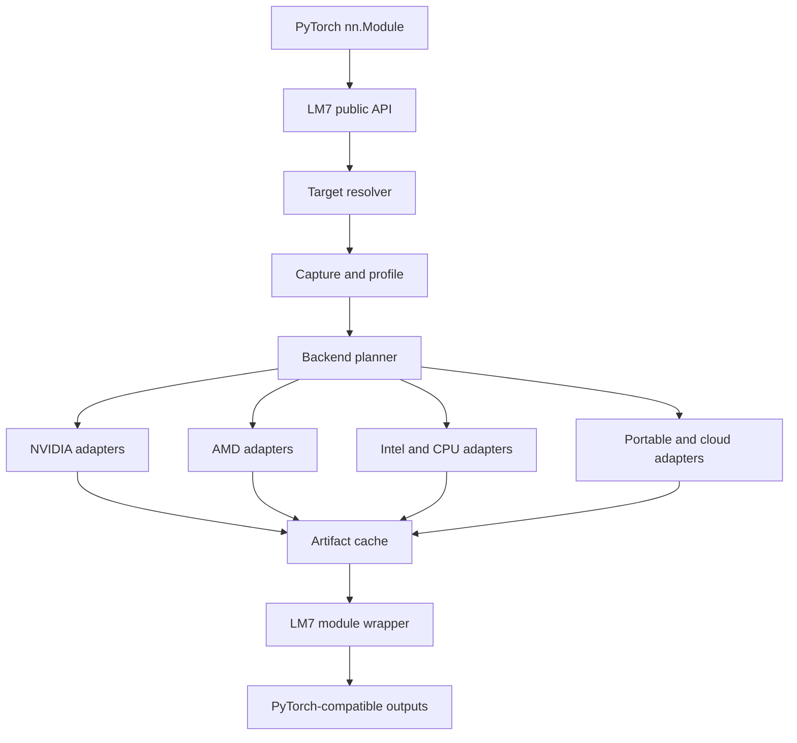
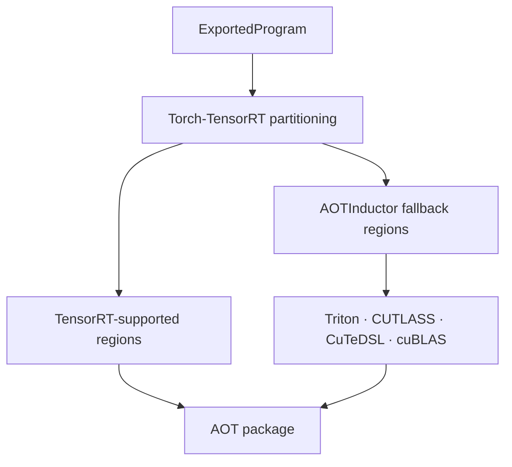
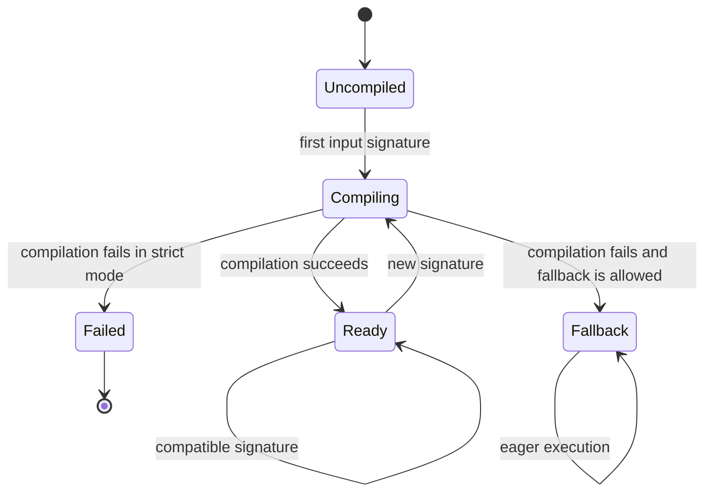
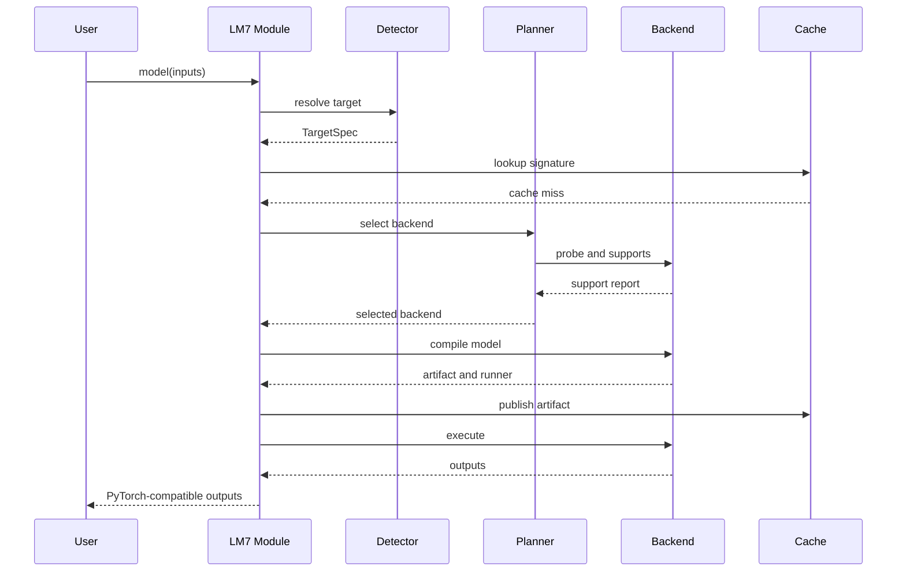
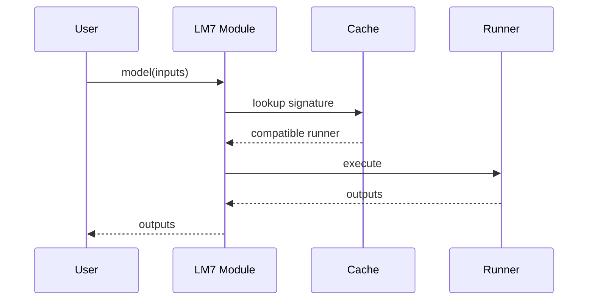

# LM7 Architecture

Status: Initial design  
Repository: <https://github.com/lmontigny/lm7>  
Scope: PyTorch inference, local hardware, lazy and ahead-of-time compilation

## 1. Overview

LM7 lets a PyTorch user run an inference model on supported hardware with one
additional line:

```python
import lm7

model = lm7.compile(model, target="auto")
output = model(inputs)
```

The user selects hardware, while LM7 selects the appropriate compiler and
runtime:

```python
model = lm7.compile(model, target="nvidia:h100")
model = lm7.compile(model, target="amd:mi300x")
model = lm7.compile(model, target="intel:gpu")
model = lm7.compile(model, target="cpu")
```

LM7 is not a new tensor library, ML compiler, kernel language, or hardware
runtime. It is a PyTorch-first orchestration layer over existing compiler
stacks.

Its responsibilities are:

- Hardware discovery and target resolution
- PyTorch model capture
- Compiler backend selection
- Lazy or ahead-of-time compilation
- Correctness validation
- Artifact caching and packaging
- Input and output adaptation
- A uniform PyTorch-compatible execution interface
- Diagnostics explaining every important decision

Existing projects remain responsible for graph optimization, fusion, tiling,
vectorization, bufferization, kernel generation, instruction selection, and
hardware runtime implementation.

## 2. Goals

### 2.1 Primary goals

1. Offer a one-line integration for ordinary PyTorch inference.
2. Let users select hardware instead of compiler implementation details.
3. Automatically detect and select compatible local hardware.
4. Reuse the best available compiler path for each target.
5. Preserve normal `torch.nn.Module` calling conventions.
6. Support lazy first-call compilation and explicit AOT compilation.
7. Keep optional compiler and runtime dependencies isolated.
8. Provide deterministic backend selection with useful explanations.
9. Cache compiled variants by target, backend, model, and input profile.
10. Make it straightforward to add new compiler and runtime adapters.

### 2.2 Secondary goals

- Build multi-target inference bundles.
- Compare compatible compiler candidates on actual hardware.
- Support stateful transformer inference.
- Offer a Python-free runtime path for AOT artifacts.
- Support remote accelerators through a later orchestration layer.

## 3. Non-goals

The initial system will not:

- Implement a new MLIR dialect
- Implement graph optimization passes
- Generate Triton, CUDA, or machine code directly
- Replace PyTorch eager execution
- Support training or backward compilation
- Provision remote hardware
- Provide distributed inference
- Guarantee peak performance on every model and target
- Guarantee arbitrary PyTorch program capture
- Define a stable cross-compiler binary ABI
- Support every quantization scheme
- Silently hide unsupported behavior

## 4. Design principles

### 4.1 Hardware is the public abstraction

Users should normally specify:

```python
target="amd:mi300x"
```

They should not need to specify:

```python
backend="iree"
```

The backend remains an expert override:

```python
model = lm7.compile(
    model,
    target="amd:mi300x",
    backend="iree",
)
```

### 4.2 Reuse native compiler entry points

LM7 uses `torch.export.ExportedProgram` as its preferred common source graph,
but it does not force all backends through one low-level intermediate
representation.

Prematurely lowering everything to StableHLO or custom MLIR could discard:

- PyTorch operator semantics
- Backend-specific quantization information
- Layout information
- Stateful model behavior
- Custom operations
- Backend-specific partitioning opportunities

Each adapter should receive the richest supported representation.

### 4.3 Compiler backends remain replaceable

No LM7 public API should depend on IREE, Inductor, TensorRT, OpenVINO, XLA, or
Neuron terminology. Compiler-specific options live under an explicitly
backend-specific escape hatch.

### 4.4 Correctness precedes performance

Compiled results should be validated against eager PyTorch during development
and optionally during artifact production. A fast incorrect backend must never
win selection.

### 4.5 Fallback is explicit

Development mode may fall back to eager execution with a warning. Production
mode can reject all fallback:

```python
model = lm7.compile(model, fallback="error")
```

## 5. System context



The architecture is divided into:

1. Public API
2. Configuration
3. Hardware discovery
4. Target resolution
5. Model capture
6. Backend registry
7. Backend planning
8. Compilation adapters
9. Artifact and cache management
10. Execution adapters
11. Module compatibility wrapper
12. Diagnostics and observability

## 6. Public API

### 6.1 Lazy compilation

```python
compiled = lm7.compile(
    model,
    target="auto",
    backend="auto",
    mode="lazy",
    transfers="automatic",
    fallback="warn",
    cache=True,
    options=None,
)
```

Proposed parameters:

| Parameter | Meaning |
|---|---|
| `model` | A `torch.nn.Module`, callable, or supported exported representation |
| `target` | Desired hardware; defaults to automatic local selection |
| `backend` | Compiler override; defaults to planner selection |
| `mode` | `lazy`, `aot`, or `eager` |
| `transfers` | `automatic` or `explicit` tensor placement |
| `fallback` | `warn`, `error`, or deliberately enabled `silent` |
| `cache` | Enable compiled-variant reuse |
| `options` | Structured LM7 and backend-specific options |

`lm7.compile()` returns immediately. Compilation happens on the first call when
`mode="lazy"`.

### 6.2 AOT export

A later explicit AOT API should use the same planner and artifact interfaces:

```python
artifact = lm7.export(
    model,
    args=(example_input,),
    kwargs={},
    target="nvidia:h100",
    output="model.lm7",
    profiles=None,
)
```

### 6.3 Inspection

```python
lm7.detect_targets()
lm7.backends()
lm7.explain(target="auto")
lm7.clear_cache()
```

`explain()` should provide ranked choices and reasons:

```text
Selected aot_inductor for nvidia:sm90.

Reasons:
- An NVIDIA H100 was detected.
- AOTInductor supports the requested mode.
- The TensorRT adapter is not installed.

Alternatives:
- inductor: supported, lower AOT preference
- eager: supported, fallback only
- iree: unavailable because iree-turbine is not installed
```

## 7. Configuration precedence

Configuration is resolved in this order:

1. Explicit function argument
2. Scoped LM7 configuration context
3. Environment variable
4. User configuration file
5. Library default

Initial environment variables:

```text
LM7_TARGET
LM7_BACKEND
LM7_CACHE_DIR
LM7_FALLBACK
LM7_LOG_LEVEL
```

Example:

```bash
LM7_TARGET=amd:mi300x python serve.py
```

The application remains:

```python
model = lm7.compile(model)
```

## 8. Target model

Target identity and compiler identity are separate.

```python
from dataclasses import dataclass, field
from typing import Any, Mapping


@dataclass(frozen=True)
class TargetSpec:
    vendor: str
    kind: str
    architecture: str | None = None
    model: str | None = None
    ordinal: int | None = None
    remote: bool = False
    attributes: Mapping[str, Any] = field(default_factory=dict)
```

Examples:

```python
TargetSpec(vendor="cpu", kind="cpu", architecture="x86_64")

TargetSpec(
    vendor="nvidia",
    kind="gpu",
    architecture="sm90",
    model="h100",
    ordinal=0,
)

TargetSpec(
    vendor="amd",
    kind="gpu",
    architecture="gfx942",
    model="mi300x",
    ordinal=0,
)
```

### 8.1 Canonical target strings

Initial parser examples:

```text
auto
cpu
nvidia
nvidia:h100
nvidia:sm90
amd
amd:mi300x
amd:gfx942
intel:gpu
apple:metal
tpu
aws:trainium
```

The parser should preserve unknown architecture suffixes when syntactically
valid so future hardware does not require immediate core-library changes.

### 8.2 Detected device

```python
@dataclass(frozen=True)
class DeviceInfo:
    target: TargetSpec
    name: str
    total_memory_bytes: int | None
    free_memory_bytes: int | None
    capabilities: Mapping[str, Any]
    source: str
```

## 9. Hardware discovery

Hardware discovery is best-effort. Missing optional integrations must not break
`import lm7`.

### 9.1 Detection sources

CPU:

- Always available
- Detect machine architecture
- Detect relevant instruction sets when practical
- Avoid requiring a compiler backend

NVIDIA:

- Check `torch.cuda.is_available()`
- Ensure `torch.version.hip` is absent
- Query device count and properties
- Derive compute capability such as `sm90`

AMD:

- ROCm PyTorch may expose devices through `torch.cuda`
- Check `torch.version.hip`
- Query device properties
- Derive architecture such as `gfx942` when exposed

Intel:

- Probe `torch.xpu` only if present
- Do not import Intel-specific packages eagerly

Apple:

- Probe `torch.backends.mps` only if present

TPU, Neuron, and other accelerators:

- Probe only when the corresponding optional adapter is installed
- Keep discovery code inside the adapter or a lazily imported provider

### 9.2 Local auto-selection

Initial policy:

1. Honor explicit target.
2. Honor `LM7_TARGET`.
3. Enumerate supported local accelerators.
4. Filter out devices with no compatible installed backend.
5. Rank remaining accelerators by configured priority.
6. Select CPU if no accelerator is viable.

`target="auto"` does not imply cloud provisioning.

## 10. Model capture

### 10.1 Lazy capture

The model wrapper obtains representative inputs from the first invocation:

```python
model = lm7.compile(model)
output = model(example_input)
```

The first call supplies:

- Tensor shapes
- Dtypes
- Strides
- Device placement
- Nested argument structure
- Values required by an export constraint

### 10.2 Preferred graph contract

For AOT-capable backends, capture should prefer:

```python
torch.export.export(model, args, kwargs, dynamic_shapes=...)
```

The resulting `ExportedProgram` is a source-level graph for backend adapters.

Not every backend needs an `ExportedProgram`:

- JIT Inductor can receive the original module.
- TensorRT integrations may perform their own capture and partitioning.
- Some vendor integrations may expose a direct PyTorch entry point.

The capture layer therefore creates an export lazily only when requested by the
selected backend.

### 10.3 Shape profiles

Users may optionally define bounded profiles:

```python
profiles = {
    "batch": (1, 16),
    "sequence": (1, 8192),
}
```

Without an explicit profile, LM7 may create shape-specialized variants:

```text
batch=1, sequence<=512
batch=1, sequence<=4096
batch<=8, sequence<=4096
```

Profile derivation must be conservative. LM7 must not silently claim that a
compiled artifact accepts shapes outside its real constraints.

## 11. Backend architecture

### 11.1 Backend metadata

```python
@dataclass(frozen=True)
class BackendInfo:
    name: str
    version: str | None
    available: bool
    modes: frozenset[str]
    capabilities: Mapping[str, Any]
    unavailable_reason: str | None = None
```

### 11.2 Compilation request

```python
@dataclass(frozen=True)
class CompileRequest:
    model: object
    target: TargetSpec
    mode: str
    transfers: str
    fallback: str
    profiles: object | None
    options: Mapping[str, Any]
```

### 11.3 Support report

Backend support is not a boolean without explanation:

```python
@dataclass(frozen=True)
class Support:
    supported: bool
    reason: str
    priority: int = 0
    limitations: tuple[str, ...] = ()
```

### 11.4 Backend protocol

```python
class Backend:
    name: str

    def probe(self) -> BackendInfo:
        ...

    def supports(self, request: CompileRequest) -> Support:
        ...

    def compile(
        self,
        request: CompileRequest,
        example_args: tuple[object, ...],
        example_kwargs: dict[str, object],
    ) -> "Artifact":
        ...

    def load(self, artifact: "Artifact") -> "Runner":
        ...
```

Compilation and execution may later be split into separate protocols when one
runtime loads artifacts from several compiler implementations.

### 11.5 Optional imports

Backend modules must not import large dependencies until:

- Their backend is explicitly requested
- Their backend is probed
- Their backend participates in target planning

The following must remain valid on a minimal CPU installation:

```python
import lm7
lm7.detect_targets()
```

## 12. Backend registry

The registry owns backend factories rather than preconstructed heavyweight
objects:

```python
registry.register("eager", create_eager_backend)
registry.register("inductor", create_inductor_backend)
```

Later, third-party packages may use entry points:

```toml
[project.entry-points."lm7.backends"]
custom_accelerator = "custom_package.backend:create_backend"
```

Registry requirements:

- Deterministic iteration
- Duplicate-name rejection
- Lazy construction
- Backend version reporting
- Clear distinction between unavailable and unsupported

## 13. Backend planner

The planner selects a backend for a resolved target.

### 13.1 Inputs

- Resolved `TargetSpec`
- Requested mode
- Explicit backend override
- Installed backend metadata
- Backend support reports
- Model/export compatibility when already known
- Precision and quantization requirements
- User policy
- Cached artifacts

### 13.2 Selection

Selection proceeds as:

1. If the backend is explicit, validate it and use it or fail.
2. Query candidate backends for target support.
3. Remove unavailable and unsupported candidates.
4. Apply target-specific base priorities.
5. Prefer a compatible cache hit.
6. Apply requested policy.
7. Select deterministically.
8. Preserve ranked alternatives and reasons.

### 13.3 Initial policy table

| Target | Primary candidates | Additional candidates |
|---|---|---|
| NVIDIA GPU | Torch-TensorRT, AOTInductor, Inductor | IREE CUDA |
| AMD GPU | AOTInductor/Inductor with Triton | IREE ROCm, MIGraphX |
| Intel GPU | OpenVINO, Inductor XPU | IREE Vulkan |
| x86 CPU | AOTInductor CPU, OpenVINO | IREE LLVM |
| Apple GPU | Core ML or ExecuTorch | IREE Metal |
| Google TPU | PyTorch/XLA and PJRT | None initially |
| AWS Trainium | torch-neuronx | PJRT if production-ready |

This table is a policy default, not a permanent claim that one compiler is
universally fastest.

### 13.4 Benchmark-based selection

A later planner may compile several candidates:

```text
Compile candidates
    -> validate numerical correctness
    -> warm up
    -> benchmark
    -> retain fastest valid artifact
```

Benchmark results are specific to:

- Model
- Weights
- Target architecture
- Shape profile
- Precision
- Backend version
- Compiler options

They must not be generalized across incompatible configurations.

## 14. Initial compiler paths

### 14.1 NVIDIA



Pure AOTInductor remains a separate candidate. IREE CUDA may later provide a
portable alternative.

LM7 does not invoke Triton directly. TorchInductor provides graph scheduling,
fusion, candidate generation, and kernel selection before invoking Triton or
other kernel implementations.

### 14.2 AMD

```text
PyTorch
    -> TorchInductor/AOTInductor
    -> Triton and ROCm libraries
    -> compiled artifact
```

IREE ROCm can be added as another candidate. The planner may select based on
coverage, requested deployment mode, or measured performance.

### 14.3 Intel and CPU

OpenVINO is a natural inference candidate for Intel hardware. Inductor provides
a PyTorch-native CPU and XPU path. IREE LLVM or Vulkan may be valuable for
portable AOT deployment.

### 14.4 TPU

```text
PyTorch
    -> PyTorch/XLA
    -> StableHLO/HLO
    -> XLA TPU compiler
    -> PJRT
```

### 14.5 AWS accelerators

```text
PyTorch
    -> torch-neuronx
    -> Neuron compiler
    -> Neuron runtime
```

## 15. Lazy module wrapper

`lm7.compile()` returns an object compatible with normal module invocation.

### 15.1 State machine



Compilation failure for one input signature must not invalidate successful
variants for other signatures.

### 15.2 Module behavior

The wrapper should preserve or delegate:

- `forward` invocation
- `eval()`
- `train()` with an inference-only warning or rejection
- `state_dict()`
- `parameters()`
- `buffers()`
- Safe attribute access

The original module remains available internally for fallback and validation.

### 15.3 Concurrency

Requirements:

- Compilation for one cache key occurs once.
- Concurrent callers wait for the same compilation result.
- Different signatures may compile independently later.
- A failed compile does not leave a lock or partial cache record.

An initial per-wrapper lock is acceptable.

## 16. Runtime abstraction

Initially, an artifact may contain an in-process Python callable:

```python
@dataclass
class Artifact:
    backend: str
    target: TargetSpec
    callable: object | None
    path: Path | None
    metadata: Mapping[str, object]
```

A later runtime interface:

```python
class Runner:
    def run(
        self,
        args: tuple[object, ...],
        kwargs: dict[str, object],
    ) -> object:
        ...

    def close(self) -> None:
        ...
```

Native runtimes may include:

- AOTI
- TensorRT
- IREE
- OpenVINO
- PJRT
- Neuron

The Python module wrapper delegates execution to a `Runner`.

## 17. Tensor placement and data exchange

### 17.1 Automatic transfers

For the one-line experience:

```python
model = lm7.compile(model, transfers="automatic")
```

LM7 recursively maps tensors found in:

- Positional arguments
- Keyword arguments
- Lists and tuples
- Dictionaries
- Named tuples
- Supported data classes

Input containers are not modified in place.

The initial PyTorch-native implementation uses `.to(device)`.

### 17.2 Explicit transfers

```python
model = lm7.compile(model, transfers="explicit")
```

LM7 verifies input placement and raises `InputDeviceError` on mismatch.

### 17.3 Output policy

Local outputs remain on the selected device by default. LM7 should not
automatically copy potentially large outputs to CPU.

For non-PyTorch runtimes, DLPack is the preferred future interchange mechanism
where safe and supported.

## 18. Artifact model

### 18.1 Initial artifact

The first implementation can retain an in-memory callable and metadata.

### 18.2 Persistent artifact

A persistent artifact needs:

- Backend name and version
- Target identity
- Compiler version
- PyTorch version
- LM7 version
- Input profile
- Model identity
- Precision and quantization
- Entry points
- Runtime requirements
- Artifact files

### 18.3 Multi-target bundle

Future layout:

```text
model.lm7/
├── manifest.json
├── exported_program.pt2
├── weights.safetensors
├── tokenizer.json
└── targets/
    ├── nvidia-sm90/
    │   └── model.pt2
    ├── amd-gfx942/
    │   └── model.pt2-or-vmfb
    ├── intel-xpu/
    │   └── model.blob
    └── cpu-x86_64/
        └── model.pt2
```

The bundle is an LM7 container, not a claim that all nested compiler artifacts
share one ABI.

## 19. Cache architecture

### 19.1 Cache layers

1. Wrapper-local compiled variants
2. Process-wide artifact cache
3. Filesystem artifact cache
4. Remote shared cache later

### 19.2 Cache key

A complete key eventually includes:

```text
model structure identity
weights identity
input tree structure
tensor shapes
tensor dtypes
tensor strides
dynamic profile
target
backend
backend version
PyTorch version
LM7 version
precision
quantization
compiler options
```

The first implementation may use in-process model identity. It must not hash
all large weights on every invocation.

### 19.3 Filesystem location

Default:

```text
~/.cache/lm7
```

Override:

```text
LM7_CACHE_DIR
```

### 19.4 Cache safety

- Write through a temporary path.
- Atomically publish completed artifacts.
- Never treat partial compilation output as valid.
- Store metadata before loading.
- Reject incompatible version or target metadata.
- Permit cache invalidation without touching original models.

## 20. Fallback behavior

Fallback policies:

| Policy | Behavior |
|---|---|
| `warn` | Use eager fallback and emit a structured warning |
| `error` | Raise the compilation or availability error |
| `silent` | Use only when explicitly requested and documented |

Fallback should occur for:

- Requested compiler unavailable
- Unsupported exported graph
- Compilation failure
- Artifact load failure when a valid eager path exists

Fallback must not swallow:

- Errors thrown by the model during normal execution
- Invalid user inputs
- Out-of-memory failures without an explicit recovery policy
- Incorrect results

## 21. Error model

```text
LM7Error
├── TargetNotFoundError
├── BackendUnavailableError
├── UnsupportedModelError
├── CaptureError
├── CompilationError
├── ArtifactLoadError
├── ValidationError
└── InputDeviceError
```

Every high-level error should identify:

- Requested target
- Resolved target
- Selected backend
- Failing stage
- Original error summary
- Suggested remediation

Original exceptions should be chained.

## 22. Diagnostics and logging

Use standard Python logging.

INFO:

- Resolved target
- Selected backend
- Cache hit or miss
- Compilation start and finish
- Fallback

DEBUG:

- Full device discovery
- Backend support reports
- Planner rankings
- Input signature
- Compiler exception chain

LM7 libraries must not unconditionally print to stdout.

Potential structured event:

```python
CompilationEvent(
    target="nvidia:sm90",
    backend="aot_inductor",
    cache_hit=False,
    duration_seconds=12.4,
    outcome="success",
)
```

## 23. Validation

### 23.1 Numerical validation

When enabled:

1. Run eager PyTorch on representative inputs.
2. Run compiled artifact.
3. Compare output tree structure.
4. Compare shapes and dtypes.
5. Compare values with configured tolerances.
6. Reject invalid candidates.

Tolerance depends on:

- Dtype
- Quantization
- Backend
- Model class

Validation metadata should be stored with persistent artifacts.

### 23.2 Performance validation

Benchmarking requires:

- Warmup iterations
- Device synchronization
- Representative shapes
- Repeated measurements
- Median and tail reporting
- Separation of compile time and execution time

Do not include first-call compilation latency in steady-state inference latency.

## 24. Security and trust

Compiled artifacts and backend plugins execute native code.

Requirements:

- Do not automatically load arbitrary third-party plugins from untrusted paths.
- Record artifact provenance.
- Validate manifest fields before loading.
- Avoid unsafe archive extraction paths.
- Treat downloaded model code and custom operators as untrusted.
- Do not deserialize arbitrary Python pickles from untrusted sources.
- Prefer documented PyTorch and backend artifact formats.

Remote artifact signing may be added later.

## 25. Repository mapping

Recommended initial structure:

```text
lm7/
├── pyproject.toml
├── README.md
├── LICENSE
├── src/
│   └── lm7/
│       ├── __init__.py
│       ├── api.py
│       ├── config.py
│       ├── errors.py
│       ├── logging.py
│       ├── module.py
│       ├── targets.py
│       ├── detection.py
│       ├── planner.py
│       ├── cache.py
│       └── backends/
│           ├── __init__.py
│           ├── base.py
│           ├── registry.py
│           ├── eager.py
│           └── inductor.py
├── tests/
│   ├── test_api.py
│   ├── test_targets.py
│   ├── test_detection.py
│   ├── test_registry.py
│   ├── test_planner.py
│   ├── test_eager_backend.py
│   └── test_cache.py
├── examples/
│   └── basic_mlp.py
└── docs/
    └── architecture.md
```

Do not create empty modules for speculative future backends.

## 26. First implementation slice

The first milestone contains:

1. `lm7.compile()`
2. Target parsing
3. CPU and PyTorch GPU discovery
4. Backend protocol and registry
5. Deterministic planner
6. Eager backend
7. Optional Inductor backend
8. Lazy module wrapper
9. In-memory variant cache
10. Structured fallback
11. `detect_targets()` and `explain()`
12. CPU-only tests
13. Basic MLP example

Example:

```python
import torch
import lm7

model = torch.nn.Sequential(
    torch.nn.Linear(16, 32),
    torch.nn.ReLU(),
    torch.nn.Linear(32, 4),
).eval()

model = lm7.compile(model, target="auto")
result = model(torch.randn(2, 16))
```

On CPU:

- `auto` resolves to CPU.
- Inductor is preferred when requested and supported.
- Eager remains the correctness reference and fallback.

## 27. First-call sequence



## 28. Subsequent-call sequence



## 29. Testing architecture

All default CI tests must run without accelerator hardware.

### 29.1 Unit tests

Target parsing:

- Valid target strings
- Aliases
- Unknown architectures
- Invalid syntax

Detection:

- CPU-only
- Mocked NVIDIA CUDA
- Mocked AMD ROCm
- Mocked Intel XPU
- Missing optional PyTorch attributes

Registry:

- Registration
- Duplicate rejection
- Lazy construction
- Unavailable dependency

Planner:

- Explicit backend
- Automatic selection
- Deterministic ordering
- Cache preference
- Fallback
- Strict failure

Module:

- Lazy compile once
- New signature creates a new variant
- Nested inputs
- Concurrent first calls
- Model execution errors remain visible

Cache:

- Equivalent signatures match
- Shape, dtype, target, and backend alter keys
- Failed writes are not published

### 29.2 Integration tests

- CPU MLP eager result
- CPU Inductor result when available
- Output comparison with `torch.testing.assert_close`

Accelerator tests should be marked and skipped cleanly when unavailable.

## 30. Evolution

### Phase 1: Local vertical slice

- CPU auto-detection
- Eager and Inductor
- Lazy wrapper
- Diagnostics
- Tests

### Phase 2: AOT artifacts

- `torch.export`
- AOTInductor
- `.pt2` artifacts
- Persistent metadata
- Shape profiles

### Phase 3: First independent compiler

Choose based on available hardware:

- IREE
- OpenVINO
- Torch-TensorRT

### Phase 4: Multi-target selection

- Compile multiple candidates
- Numerical validation
- Benchmark-based selection
- Multi-target bundles

### Phase 5: LLM runtime

- Hugging Face adapters
- Tokenizer packaging
- `prefill()`
- `decode()`
- KV-cache lifecycle
- Quantization

### Phase 6: Remote execution

Only after the local architecture is stable:

- Remote device inventory
- Authentication
- Artifact upload
- Weight caching
- RPC transport
- Provisioning and lifecycle
- Cost-aware policy

Remote targets should use explicit syntax:

```python
model = lm7.compile(model, target="cloud:nvidia:h100")
```

They must not be silently selected by local `target="auto"` in the initial
design.

## 31. Architectural comparison

ZML follows a primarily unified compiler route:

```text
Zig model
    -> symbolic tensor graph
    -> MLIR/MHLO
    -> OpenXLA
    -> PJRT
    -> hardware
```

LM7 uses a target-native route:

```text
PyTorch model
    -> LM7 target planner
    -> best existing compiler for target
    -> LM7 artifact/runtime adapter
    -> hardware
```

The LM7 approach has more integration work and less compiler uniformity, but it
avoids rebuilding compiler optimizations and can follow the strongest
production path for each hardware family.

## 32. Architectural decisions summary

| Decision | Choice |
|---|---|
| User abstraction | Hardware target |
| Source framework | PyTorch |
| Common graph contract | `ExportedProgram` when required |
| Compiler strategy | Existing target-native compilers |
| Initial execution | Lazy local compilation |
| Initial backends | Eager and Inductor |
| Fallback | Configurable, visible |
| Cache | In-memory first, persistent later |
| Plugin loading | Lazy |
| Training | Out of scope |
| Remote hardware | Later explicit layer |
| Custom MLIR passes | None in initial architecture |

## 33. References

- PyTorch export: <https://docs.pytorch.org/docs/stable/user_guide/torch_compiler/export.html>
- PyTorch custom compiler backends: <https://docs.pytorch.org/docs/stable/user_guide/torch_compiler/torch.compiler_custom_backends.html>
- AOTInductor: <https://docs.pytorch.org/docs/stable/user_guide/torch_compiler/torch.compiler_aot_inductor.html>
- IREE PyTorch integration: <https://iree.dev/guides/ml-frameworks/pytorch/>
- IREE deployment targets: <https://iree.dev/guides/deployment-configurations/>
- OpenXLA/PJRT terminology: <https://openxla.org/xla/terminology>
- XLA GPU architecture: <https://openxla.org/xla/gpu_architecture>
- Torch-TensorRT AOTInductor deployment: <https://docs.pytorch.org/TensorRT/user_guide/runtime_performance/aot_inductor.html>
